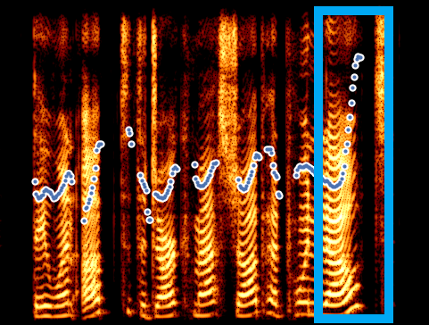
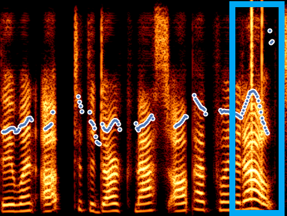
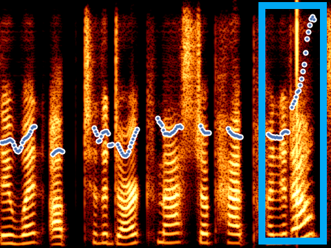

<!-- 

In this post, we show the demo of ED-TTS: Multi-Scale Emotion Modeling using Cross-Domain Emotion Diarization for Emotional Speech Synthesis

 -->

## Abstract

Previous emotional speech synthesis methods use an utterance level style embedding extracted from reference audio, which ignores the multi-scale nature of speech prosody. In this paper, we propose ED-TTS, a multi-scale emotional speech synthesis framework based on Speech Emotion Diarization (SED) and Speech Emotion Recognition (SER) to model the emotion from different levels. Specifically, the proposed method combines utterance-level emotion embedding extracted by SER with fine-grained frame-level emotion embeddings extracted by a SED model to condition the reverse process of denoising diffusion probabilistic model (DDPM). Moreover, we employ cross-domain SED to predict accurate soft labels, solving the problem of lack of fine-grained emotion-annotated dataset for supervising emotional TTS training. ED-TTS significantly outperforms recent emotional TTS baselines in both objective and subjective evaluation.

## Model Architecture

 
The overview of ED-TTS and cross-domain training for SED. The color in waveforms denotes the predicted frame-level emotion labels by SED (e.g. red for non-neutral and blue for neutral). Extracter denotes CNN-based feature encoder of SED 

## Experiment
### Dataset
We select the ESD dataset to perform the model training. We use English part of the ESD database spoken by 10 native English (5 male and 5 female) in five emotions: Neutral, Angry, Happy, Sad, and Surprise. Importantly, we add "statement" and "question" labels with the help of K-means method similar to Into-TTS. After adding ”statement” and ”question” labels there are 1440 statements and 310 questions (160 normal questions and 150 declarative questions) for each speaker on average. Besides, declarative questions are mainly distributed in the emotion of surprise. We follow the data partition given in ESD dataset: training set (1500 utterances), reference set (150 utterances), and test set (100 utterances).

&nbsp;
 

### Parallel Style Transfer
In parallel style transfer, the synthesizer is given an audio clip matching the text it’s asked to synthesize (i.e. the reference and target text are the same). QI-TTS can successfully transfer correct intonation in reference audio while the vanilla GST sometimes failed even with question mark.

<!-- 

    
    

       
&nbsp;
 

Figure.1 The architecture of the functional digestive metabolic network,
 -->

<table>
    <tr>
        <td >
 
</td>
        <td >
 
</td>
        <td >
 
</td>
    </tr>
    <tr>
		<th> (A) Ground Truth </th>
		<th> (B) Fastspeech2 + GST (w/o final syllable level) </th>
		<th> (C) QI-TTS </th>
    </tr>

	
</table>

 Visualizations of generated Mel-spectrograms of "They went up to the dark mass job had pointed out?" during parallel style transfer.

<table>
    <tr>
	<th> Target Text</th>
	<th> Emotion </th>   
	<th> Ground Truth</th>
        <th> Fastspeech2 + GST </th>
        <th> proposed </th>
    </tr>

    <tr>
        <th> They went up to the dark mass job had pointed out? </th>
	    <th> Surprise </th>
	<th> <audio controls id="player" onplay="pauseOthers(this);"><source src="assets/Demo/parallel/0016_001404.wav" type="audio/mpeg"></audio> </th>
        <th> <audio controls id="player" onplay="pauseOthers(this);"><source src="assets/Demo/parallel/0016_001404-Surprise_G.wav" type="audio/mpeg"></audio> </th>
        <th> <audio controls id="player" onplay="pauseOthers(this);"><source src="assets/Demo/parallel/0016_001404-Surprise_MG.wav" type="audio/mpeg"></audio> </th>
    </tr>
	
    <tr>
        <th> Clear than clear water? </th>
	    <th> Surprise </th>
	<th> <audio controls id="player" onplay="pauseOthers(this);"><source src="assets/Demo/parallel/0016_001405.wav" type="audio/mpeg"></audio> </th>
        <th> <audio controls id="player" onplay="pauseOthers(this);"><source src="assets/Demo/parallel/0016_001405-Surprise_G.wav" type="audio/mpeg"></audio> </th>
        <th> <audio controls id="player" onplay="pauseOthers(this);"><source src="assets/Demo/parallel/0016_001405-Surprise_MG.wav" type="audio/mpeg"></audio> </th>
    </tr>
	
    <tr>
        <th> At the roots of a bush of a grass. </th>
	<th> Happy </th>
	<th> <audio controls id="player" onplay="pauseOthers(this);"><source src="assets/Demo/parallel/0012_000720.wav" type="audio/mpeg"></audio> </th>
        <th> <audio controls id="player" onplay="pauseOthers(this);"><source src="assets/Demo/parallel/0012_000720-Happy_G.wav" type="audio/mpeg"></audio> </th>
        <th> <audio controls id="player" onplay="pauseOthers(this);"><source src="assets/Demo/parallel/0012_000720-Happy_MG.wav" type="audio/mpeg"></audio> </th>
    </tr>
	
    <tr>
        <th> Why has this egg not broken? </th>
	    <th> Angry </th>
	<th> <audio controls id="player" onplay="pauseOthers(this);"><source src="assets/Demo/parallel/0013_000367.wav" type="audio/mpeg"></audio> </th>
        <th> <audio controls id="player" onplay="pauseOthers(this);"><source src="assets/Demo/parallel/0013_000367-Angry_MG.wav" type="audio/mpeg"></audio> </th>
        <th> <audio controls id="player" onplay="pauseOthers(this);"><source src="assets/Demo/parallel/0013_000367-Angry_G.wav" type="audio/mpeg"></audio> </th>
    </tr>
	
    <tr>
        <th> Andy what's the gyre and to gimble? </th>
	<th> Sad </th>
	<th> <audio controls id="player" onplay="pauseOthers(this);"><source src="assets/Demo/parallel/0013_001056.wav" type="audio/mpeg"></audio> </th>
        <th> <audio controls id="player" onplay="pauseOthers(this);"><source src="assets/Demo/parallel/0013_001056-Sad_G.wav" type="audio/mpeg"></audio> </th>
        <th> <audio controls id="player" onplay="pauseOthers(this);"><source src="assets/Demo/parallel/0013_001056-Sad_MG.wav" type="audio/mpeg"></audio> </th>
    </tr>
</table>

<!--     <tr>
        <th> I have bunburyed all over goat on two separate occasions. </th>
	    <th> Surprise </th>
	<th> <audio controls id="player" onplay="pauseOthers(this);"><source src="assets/Demo/parallel/0019_001413.wav" type="audio/mpeg"></audio> </th>
        <th> <audio controls id="player" onplay="pauseOthers(this);"><source src="assets/Demo/parallel/0019_001413-Surprise_G.wav" type="audio/mpeg"></audio> </th>
        <th> <audio controls id="player" onplay="pauseOthers(this);"><source src="assets/Demo/parallel/0019_001413-Surprise_MG.wav" type="audio/mpeg"></audio> </th>
    </tr> -->

### Non-Parallel Transfer
In non-parallel style transfer, the TTS system must transfer prosodic style when the source and target text are completely different.

<table>
    <tr>
	<th> Reference Text:</th>
	<th> Reference Audio</th>
    </tr>
    <tr>
       	<th> Clear than clear water? (female) </th>
       	<th> <audio controls id="player" onplay="pauseOthers(this);"><source src="assets/Demo/unpara/female/16-1405/ref.wav" type="audio/mpeg"></audio> </th>
    </tr>
	
    <tr>
	<th> Target Text</th>
	<th> proposed</th>
    </tr>
    <tr>
	<th> We have been fine, haven't we? </th>
       	<th> <audio controls id="player" onplay="pauseOthers(this);"><source src="assets/Demo/unpara/female/16-1405/0018_001234-Sad.wav" type="audio/mpeg"></audio> </th>
    </tr>
    <tr>
	<th> Do you know the lid opens? </th>
       	<th> <audio controls id="player" onplay="pauseOthers(this);"><source src="assets/Demo/unpara/female/16-1405/0018_001274-Sad.wav" type="audio/mpeg"></audio> </th>
    </tr>
    <tr>
	<th> Our King George is labourers? </th>
       	<th> <audio controls id="player" onplay="pauseOthers(this);"><source src="assets/Demo/unpara/female/16-1405/0020_000120-Neutral.wav" type="audio/mpeg"></audio> </th>
    </tr>
    <tr>
	<th> Can your name be more hilarious? </th>
       	<th> <audio controls id="player" onplay="pauseOthers(this);"><source src="assets/Demo/unpara/female/16-1405/0020_000276-Neutral.wav" type="audio/mpeg"></audio> </th>
    </tr>
</table>	

<table>
    <tr>
	<th> Reference Text:</th>
	<th> Reference Audio</th>
    </tr>
    <tr>
       	<th> Andy what's the gyre and to gimble? (male) </th>
       	<th> <audio controls id="player" onplay="pauseOthers(this);"><source src="assets/Demo/unpara/male/13-1406/ref.wav" type="audio/mpeg"></audio> </th>
    </tr>
	
    <tr>
	<th> Target Text</th>
	<th> proposed</th>
    </tr>
    <tr>
	<th> We have been fine, haven't we? </th>
       	<th> <audio controls id="player" onplay="pauseOthers(this);"><source src="assets/Demo/unpara/male/13-1406/0018_001234-Sad.wav" type="audio/mpeg"></audio> </th>
    </tr>
    <tr>
	<th> Do you know the lid opens? </th>
       	<th> <audio controls id="player" onplay="pauseOthers(this);"><source src="assets/Demo/unpara/male/13-1406/0018_001274-Sad.wav" type="audio/mpeg"></audio> </th>
    </tr>
    <tr>
	<th> Our King George is labourers? </th>
       	<th> <audio controls id="player" onplay="pauseOthers(this);"><source src="assets/Demo/unpara/male/13-1406/0020_000120-Neutral.wav" type="audio/mpeg"></audio> </th>
    </tr>
    <tr>
	<th> Can your name be more hilarious? </th>
       	<th> <audio controls id="player" onplay="pauseOthers(this);"><source src="assets/Demo/unpara/male/13-1406/0020_000276-Neutral.wav" type="audio/mpeg"></audio> </th>
    </tr>
</table>

### Questioning Intonation Intensity Control

<table>
    <tr> 
        <th> Text </th>
	<th style="5px;word-wrap;word-break"> Intensity = 0.3 (Most Weak)</th>
        <th style="5px;word-wrap;word-break"> Intensity = 0.6 (Medium) </th>
        <th style="5px;word-wrap;word-break"> Intensity = 0.9 (Most Strong) </th>
    </tr>

	<tr>
        <th> A nauseous draught? </th>
	<th> <audio controls id="player" onplay="pauseOthers(this);"><source src="assets/Demo/intensity/0019_001410-Surprise-MG1.5.wav" type="audio/mpeg"></audio> </th>
        <th> <audio controls id="player" onplay="pauseOthers(this);"><source src="assets/Demo/intensity/0019_001410-Surprise-MG.wav" type="audio/mpeg"></audio> </th>
        <th> <audio controls id="player" onplay="pauseOthers(this);"><source src="assets/Demo/intensity/0019_001410-Surprise-MG2.wav" type="audio/mpeg"></audio> </th>
        </tr>
	
	<tr>
        <th> On the twenty second of last march? </th>
	<th> <audio controls id="player" onplay="pauseOthers(this);"><source src="assets/Demo/intensity/0019_001409-Surprise-MG.wav" type="audio/mpeg"></audio> </th>
        <th> <audio controls id="player" onplay="pauseOthers(this);"><source src="assets/Demo/intensity/0019_001409-Surprise-MG1.5.wav" type="audio/mpeg"></audio> </th>
        <th> <audio controls id="player" onplay="pauseOthers(this);"><source src="assets/Demo/intensity/0019_001409-Surprise-MG2.wav" type="audio/mpeg"></audio> </th>
        </tr>

   	<tr>
        <th> Andy what's the gyre and to gimble? </th>
	<th> <audio controls id="player" onplay="pauseOthers(this);"><source src="assets/Demo/intensity/0011_001406-Surprise-G.wav" type="audio/mpeg"></audio> </th>
        <th> <audio controls id="player" onplay="pauseOthers(this);"><source src="assets/Demo/intensity/0011_001406-Surprise-MG1.5.wav" type="audio/mpeg"></audio> </th>
        <th> <audio controls id="player" onplay="pauseOthers(this);"><source src="assets/Demo/intensity/0011_001406-Surprise-MG2.wav" type="audio/mpeg"></audio> </th>
        </tr>
	
	<tr>
        <th> At the end of four? </th>
	<th> <audio controls id="player" onplay="pauseOthers(this);"><source src="assets/Demo/intensity/0017_001419-Surprise-MG1.5.wav" type="audio/mpeg"></audio> </th>
        <th> <audio controls id="player" onplay="pauseOthers(this);"><source src="assets/Demo/intensity/0017_001419-Surprise-MG.wav" type="audio/mpeg"></audio> </th>
        <th> <audio controls id="player" onplay="pauseOthers(this);"><source src="assets/Demo/intensity/0017_001419-Surprise-MG2.wav" type="audio/mpeg"></audio> </th>
        </tr>
	
	

</table>
